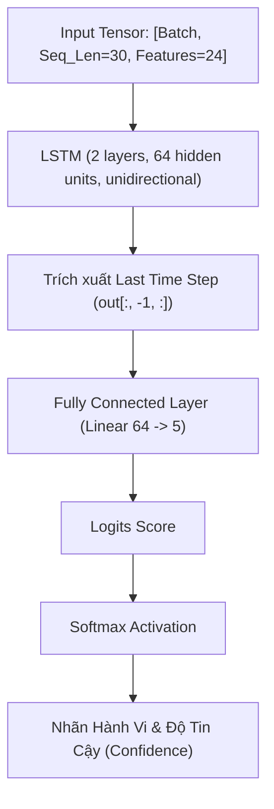
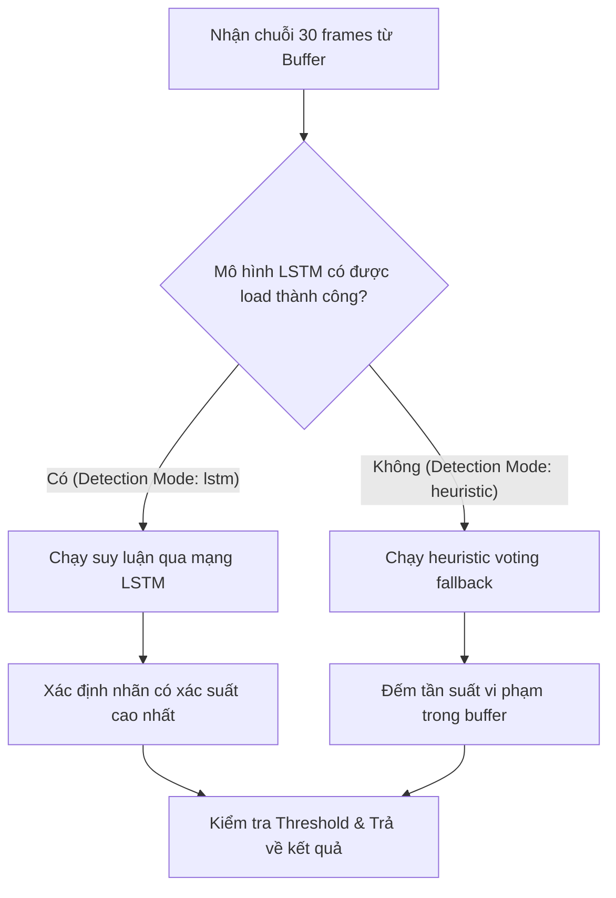

# Tài Liệu Phân Tích Hành Vi Bằng LSTM (LSTM Behavior Analysis)

Tài liệu này mô tả chi tiết kiến trúc mạng học sâu LSTM (Long Short-Term Memory), quy trình chuẩn bị/xử lý dữ liệu chuỗi thời gian đặc trưng, quy trình huấn luyện và tích hợp suy luận thời gian thực trong Hệ Thống Giám Sát Thi Cử Thông Minh.

---

## 🏛️ 1. Tổng Quan Kiến Trúc Mô Hình (Model Architecture)

Mô hình học sâu sử dụng mạng **PyTorch LSTM** để phân loại chuỗi dữ liệu thời gian gồm các đặc trưng tư thế (head pose + landmarks) và vật thể xung quanh nhằm đưa ra nhận diện gian lận chính xác nhất.



### Thông Số Kỹ Thuật (Model Specs)
* **Kích thước đầu vào (Input Dimension):** `24` features cho mỗi frame.
* **Độ dài chuỗi (Sequence Length):** `30` frames (tương đương khoảng 1-2 giây tùy thuộc vào FPS đầu vào).
* **Số lớp LSTM (LSTM Layers):** `2` layers.
* **Số unit ẩn (Hidden Dimensions):** `64` units.
* **Cổng ra (Output Classes):** `5` lớp hành vi tương ứng:

| Nhãn (Class Index) | Tên Hành Vi (Class Name) | Mô Tả |
| :---: | :---: | :--- |
| **0** | `normal` | Ngồi làm bài nghiêm túc, mắt nhìn hướng màn hình. |
| **1** | `phone_usage` | Sử dụng điện thoại di động (có nhãn điện thoại + tay đưa lên). |
| **2** | `looking_away` | Quay đầu sang trái/phải, ngửa cổ hoặc cúi đầu quá sâu. |
| **3** | `cheat_sheet` | Nhìn hoặc lật tài liệu giấy trên bàn thi. |
| **4** | `turning_around` | Quay hẳn người ra sau hoặc ngồi lệch góc quá lớn. |

---

## 🔄 2. Đường Ống Đặc Trưng (Data Pipeline & Feature Vector)

Hàm `to_feature_tensor()` trong `time_series_buffer.py` chịu trách nhiệm chuyển đổi một window gồm 30 frames gần nhất của thí sinh thành một ma trận đặc trưng có kích thước `[30, 24]`.

### Chi tiết 24 Chiều Đặc Trưng (Features Mapping):

| Chỉ số (Index) | Tên Đặc Trưng | Khoảng Giá Trị | Mô Tả |
| :---: | :--- | :---: | :--- |
| **`[0]`** | `yaw` | `[-1.0, 1.0]` | Góc quay đầu sang trái (-)/phải (+) (đã chia cho 180) |
| **`[1]`** | `pitch` | `[-1.0, 1.0]` | Góc cúi (-) / ngẩng (+) đầu (đã chia cho 180) |
| **`[2]`** | `roll` | `[-1.0, 1.0]` | Góc nghiêng đầu sang trái (-)/phải (+) (đã chia cho 180) |
| **`[3, 4]`** | `nose_x, nose_y` | `[0.0, 1.0]` | Tọa độ chuẩn hóa của mũi (Nose) |
| **`[5, 6]`** | `l_shoulder_x, l_shoulder_y` | `[0.0, 1.0]` | Tọa độ chuẩn hóa của vai trái (Left Shoulder) |
| **`[7, 8]`** | `r_shoulder_x, r_shoulder_y` | `[0.0, 1.0]` | Tọa độ chuẩn hóa của vai phải (Right Shoulder) |
| **`[9, 10]`** | `l_elbow_x, l_elbow_y` | `[0.0, 1.0]` | Tọa độ chuẩn hóa của khuỷu tay trái (Left Elbow) |
| **`[11, 12]`** | `r_elbow_x, r_elbow_y` | `[0.0, 1.0]` | Tọa độ chuẩn hóa của khuỷu tay phải (Right Elbow) |
| **`[13, 14]`** | `l_wrist_x, l_wrist_y` | `[0.0, 1.0]` | Tọa độ chuẩn hóa của cổ tay trái (Left Wrist) |
| **`[15, 16]`** | `r_wrist_x, r_wrist_y` | `[0.0, 1.0]` | Tọa độ chuẩn hóa của cổ tay phải (Right Wrist) |
| **`[17, 18]`** | `l_hip_x, l_hip_y` | `[0.0, 1.0]` | Tọa độ chuẩn hóa của hông trái (Left Hip) |
| **`[19, 20]`** | `r_hip_x, r_hip_y` | `[0.0, 1.0]` | Tọa độ chuẩn hóa của hông phải (Right Hip) |
| **`[21]`** | `has_phone` | `0.0` hoặc `1.0` | Đạt `1.0` nếu phát hiện vật thể "cell phone" gần thí sinh |
| **`[22]`** | `has_book` | `0.0` hoặc `1.0` | Đạt `1.0` nếu phát hiện vật thể "book" gần thí sinh |
| **`[23]`** | `face_visible` | `0.0` hoặc `1.0` | Đạt `1.0` nếu MediaPipe phát hiện và dựng được khuôn mặt |

> [!NOTE]
> **Xử lý Đối Xứng Camera (Mirrored Calibration):** 
> Hệ thống tự động xác định trạng thái gương của camera bằng cách đo độ lệch `left_shoulder` và `right_shoulder` khi thí sinh ngồi nhìn thẳng. Điều này giúp điều chỉnh tọa độ x-y chính xác và nhất quán.

---

## 🏋️ 3. Quy Trình Huấn Luyện (`train_lstm.py`)

Do dữ liệu thực tế về hành vi gian lận khó thu thập ở quy mô lớn, dự án cung cấp script `train_lstm.py` tích hợp bộ sinh dữ liệu giả lập chất lượng cao **`SyntheticBehaviorDataset`**.

### Mô Phỏng Quy Luật Sinh Dữ Liệu Các Lớp Hành Vi:
* **Normal (Class 0):** Sinh chuyển động nhỏ (nhiễu ngẫu nhiên) xung quanh tọa độ ngồi chuẩn trước camera. Góc quay đầu ổn định gần $0^{\circ}$.
* **Phone Usage (Class 1):** Bắt đầu từ giữa chuỗi thời gian (frames 10-15), nhãn `cell phone` được gán = `1.0`. Đồng thời, một trong hai cổ tay (wrist) được kéo lên cao tiệm cận vùng đầu (tọa độ y giảm về khoảng `0.35`).
* **Looking Away (Class 2):** Góc `yaw` tăng dần lên tối thiểu $35^{\circ}$ (quay sang trái/phải) hoặc góc `pitch` thay đổi lớn (nhìn xuống gầm bàn hoặc ngửa lên trần), tọa độ mũi di chuyển đáng kể.
* **Cheat Sheet (Class 3):** Nhãn `book` xuất hiện bằng `1.0`. Đồng thời góc `pitch` cúi xuống sâu liên tiếp và 2 tay được di chuyển lại gần khu vực bàn viết (y-coord tăng lên `0.85`).
* **Turning Around (Class 4):** Không phát hiện khuôn mặt (`face_visible = 0.0`), hoặc tọa độ 2 vai đổi chéo vị trí cho nhau (vai trái chui sang vị trí vai phải và ngược lại do quay người $180^{\circ}$).

### Quá Trình Huấn Luyện (Training Loop):
* **Optimizer:** Adam (Learning Rate = `0.001`, Weight Decay = `1e-4`).
* **Loss Function:** CrossEntropyLoss.
* **Số Epochs mặc định:** `15` epochs.
* **Tỷ lệ Dataset:** 5000 mẫu train, 1000 mẫu validation (cân bằng hoàn toàn giữa các class).
* **Kết quả đầu ra:** File trọng số mạng lưu tại `AI/backend/models/behavior_lstm.pth`.

**Lệnh chạy huấn luyện:**
```bash
cd AI
source venv/bin/activate
python3 backend/train_lstm.py
```

---

## 🔌 4. Cơ Chế Tích Hợp & Chế Độ Fallback (Inference & Fallback)

Trong `behavior_analyzer.py`, hệ thống duy trì hai cơ chế phân tích song song: **Heuristic (Luật cứng)** và **LSTM (Trí tuệ nhân tạo)**.



### Quy Trình Suy Luận Của LSTM:
1. **Lấy chuỗi đặc trưng:** Trích xuất ma trận `[30, 24]` từ buffer người dùng.
2. **Suy luận (Inference):** 
   * Đưa dữ liệu qua mô hình `BehaviorLSTMClassifier`.
   * Sử dụng hàm `softmax` để tính xác suất phân phối của 5 lớp.
3. **Phân tích kết quả:**
   * Nếu nhãn dự đoán khác `normal` và **Độ tin cậy (Confidence) > Ngưỡng (Threshold)** (mặc định là `0.75`), hệ thống ghi nhận hành vi vi phạm tương ứng.
   * Nếu không đạt ngưỡng, hệ thống trả về trạng thái `normal` để tránh báo động giả (False Positive).

### Bật/Tắt Chế Độ Nhận Diện Qua API:
Hệ thống cung cấp Endpoint để cập nhật chế độ nhận diện động:
* **HTTP Method:** `PUT`
* **Endpoint:** `/api/monitoring/config/detection-mode`
* **Query Parameter:** `detection_mode` (`lstm` hoặc `heuristic`)
* **Hành động:** Chuyển đổi linh hoạt cách thức phân tích dữ liệu camera của tất cả thí sinh thời gian thực.

---

## 🆚 5. So Sánh Giữa LSTM (Mới) và Heuristic Voting (Cũ)

Dưới đây là so sánh chi tiết giữa cơ chế nhận diện hành vi bằng mô hình học sâu **LSTM** và thuật toán đếm **Heuristic Voting**:

| Tiêu chí so sánh | Phương pháp Heuristic (Cũ) | Phương pháp LSTM (Mới) |
| :--- | :--- | :--- |
| **Bản chất thuật toán** | Lập trình luật cứng (Rule-based) & Đếm tần suất (Voting) | Mạng nơ-ron hồi quy học sâu (PyTorch LSTM Classifier) |
| **Độ nhạy thời gian** | Đánh giá độc lập từng frame, sau đó tính tỷ lệ % vi phạm trong sliding window | Phân tích sự biến thiên của 24 đặc trưng theo dòng thời gian liền mạch |
| **Xác định hành vi** | Viết code thủ công bằng logic `if-else` trên các ngưỡng góc tĩnh (như góc đầu, vai...) | Tự động học đặc trưng chuyển động từ tập dữ liệu huấn luyện động |
| **Đầu ra phân tích** | Báo cáo đồng thời nhiều lỗi độc lập (như vừa quay đầu vừa dùng điện thoại) | Phân loại ra **1 nhãn hành vi duy nhất** có xác suất cao nhất |
| **Khả năng mở rộng** | Rất khó. Phải viết lại các biểu thức toán học thủ công để bắt hành vi mới | Rất dễ. Chỉ cần bổ sung mẫu dữ liệu vào Dataset và huấn luyện lại mô hình |

### Ưu điểm vượt trội của LSTM:
1. **Hiểu ngữ cảnh động:** Nhận diện hành động cử động tay lên mặt hoặc cúi đầu làm bài theo trình tự thời gian thay vì so sánh góc đầu tĩnh đơn giản.
2. **Hạn chế báo động giả (False Positives):** Nhờ cơ chế kiểm soát bằng độ tin cậy của Softmax (ngưỡng `0.75`), tránh việc spam cảnh báo khi thí sinh chỉ xoay đầu nhẹ tự nhiên.
3. **Mã nguồn tối giản:** Tránh được hàng trăm dòng code kiểm tra tọa độ thủ công phức tạp trong logic nghiệp vụ của file phân tích.

